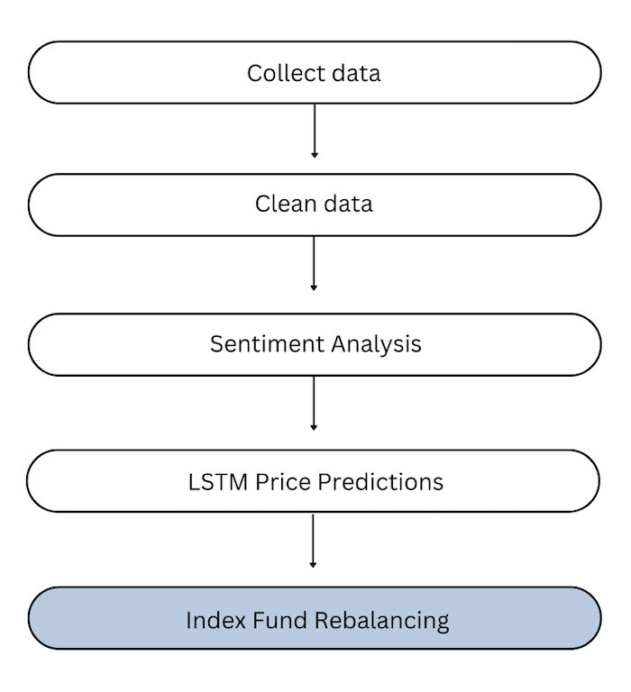

.. _pipeline:

Pipeline
========

The pipeline for this cryptocurrency price prediction and rebalancing follows the process:

For each coin, the following process occurs in parallel:

1) Price data for past 30 days is collected
2) News data for past 30 days is collected
3) The news and price data are combined into a clean, cohesive dataset using the given coin's respective cleaning processor
4) The clean, combined dataset is passed through for sentiment analysis
5) The outputted sentiment analysis dataset is passed as input to the LSTM model
6) The predicted prices from the LSTM model are stored in a new collective dataframe with the other coins' data

Once this is complete, the collective dataframe with all the coins' predicted prices is passed to an index fund
rebalancing algorithm.

This whole process occurs in the **app.py** script which uses streamlit (a simple UI tool) to run and display this
process.